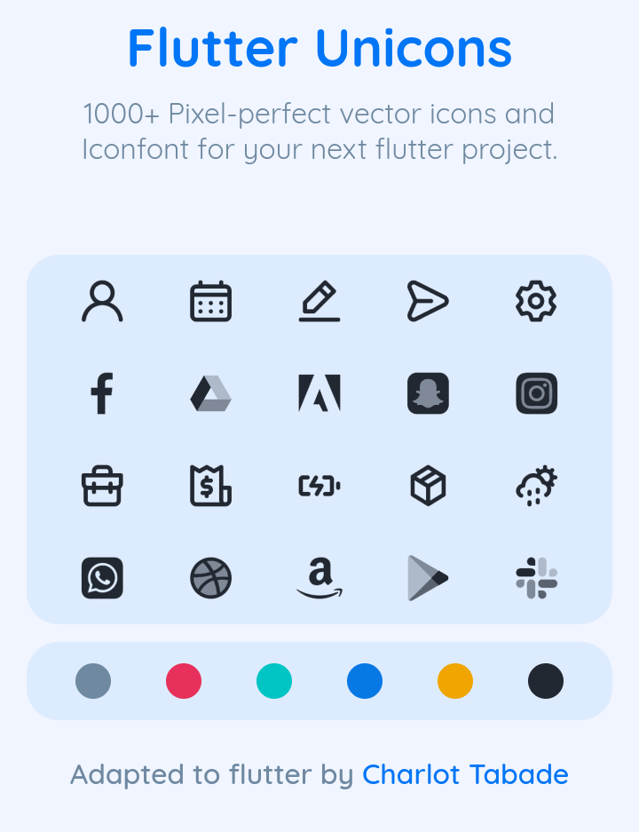

# flutter_unicons

</br>

1000+ Pixel-perfect svg unicons for your next flutter project ispired by [Unicons](https://github.com/iconscout/unicons) and [vue-unicons](https://github.com/antonreshetov/vue-unicons/blob/master/README.md)

## Demo

Download the gallery app using [google drive](https://drive.google.com/.../1SNAMawJttsGmDknSPIB.../view...) or get the apks [here](https://github.com/charles9904/flutter_unicons_gallery/releases/tag/Flutter_unicons) .

## Installation

Add dependency to your **pubspec.yaml**

```yaml
dependencies:
  flutter_unicons: 0.0.1
```

## Usage

```dart
import 'package:flutter_unicons/flutter_unicons.dart';

class Demo extends StatelessWidget{
  @override
  Widget build(BuildContext context) {
    return SafeArea(
      child: Column(
        children: [
          Unicon(UniconData.uniLayerGroup),
          Unicon(UniconData.uniCommentAlt)
        ]
      )
    );
  }
}
```

## Licence

Vue Unicons licensed under MIT.

[Unicons](https://github.com/iconscout/unicons) licensed under Apache 2.0
